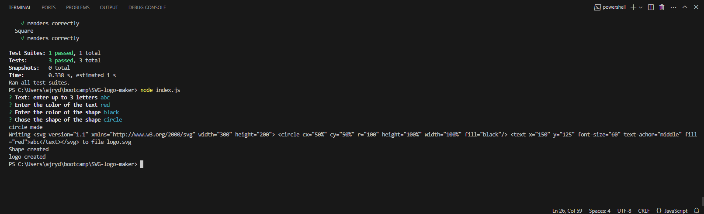
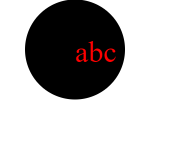

# SVG Logo Maker

## Description

```md
AS a freelance web developer
I WANT to generate a simple logo for my projects
that takes user input to create the logo
```

### Usage

- npm i to install dependancies
- run node index.js
- answer promted questions
- view logo output in browser
- npm test to view test cases

## Technolgies

- JavaScript
- Node.js
- Jest
- Inquirer.js 

## Screenshot




## links

[Video](https://drive.google.com/file/d/1WtM6jCFgT-SDropQJfqU3WMLJcmSNQ1m/view)

[GitHub](https://github.com/Zorzorac05/SVG-logo-maker)